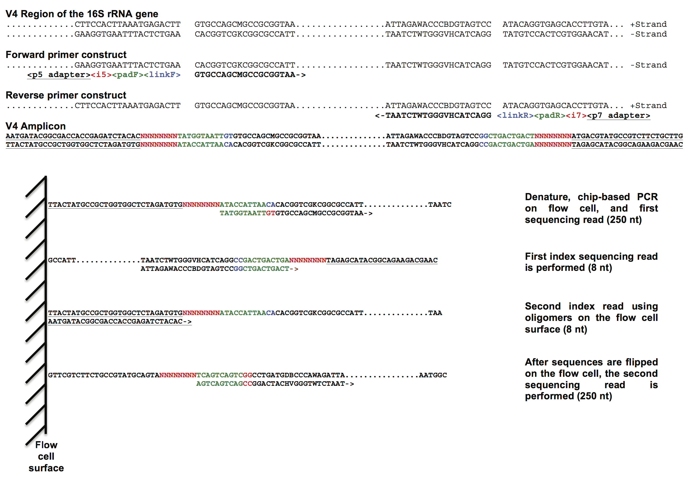
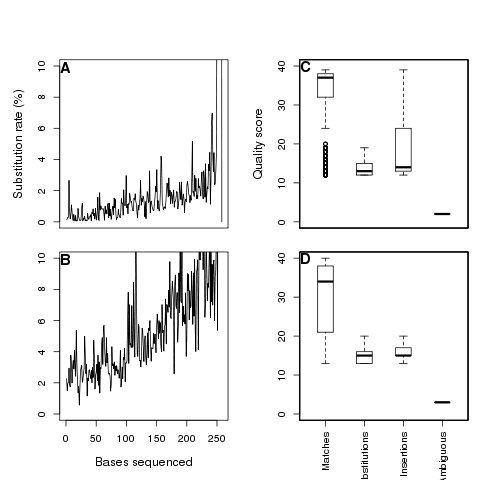

> **Note:** This page was generated from a Rmarkdown document that was made
> after the [original Kozich et al. manuscript](http://www.ncbi.nlm.nih.gov/pmc/articles/PMC3753973/)
> was published in *Applied and *Environmental Microbiology* in 2013. We have
> inserted the numbers calculated using the methods in the accompanying [GitHub repository]()
> in **boldface**. Readers may have noticed that Tables S1 and S2 were expanded versions
> of Tables 1 and 2; therefore, we only represent Tables S1 and S2 here. Also,
> in the original manuscript (and here) Figures 2 and 3 only contained data from
> run 130403. You may find the same figures generated for the other runs in the
> results/figures folder of the repository. Finally, At this point we have only
> updated the 16S rRNA gene sequence data; we have not attempted to replicate
> the analysis of the metagenomic data.

## Development of a dual-index sequencing strategy and curation pipeline
## for analyzing amplicon sequence data on the MiSeq Illumina sequencing
## platform

**Running title:** Sequencing 16S rRNA genes on a MiSeq

James J. Kozich<sup>1</sup>, Sarah L. Westcott<sup>1</sup>, Nielson T.
Baxter<sup>1</sup>, Sarah K. Highlander<sup>2</sup>, and Patrick D.
Schloss<sup>1</sup>\*

> \* Correspondence: <pschloss@umich.edu>
> 734.647.5801
>
> Department of Microbiology and Immunology
>
> University of Michigan
>
> 5618 Medical Sciences II
>
> 1500 W. Medical Center Dr.
>
> Ann Arbor, MI 48109

1 Department of Microbiology and Immunology, 1500 W. Medical Center,
University of Michigan, Ann Arbor, MI 48109

2 Department of Molecular Virology and Microbiology, One Baylor Plaza
BCM 280, Baylor College of Medicine, Houston, TX 77030

### Abstract

Rapid advances in sequencing technology have changed the experimental
landscape of microbial ecology. In the last 10 years the field has moved
from sequencing hundreds of 16S rRNA gene fragments per study using
clone libraries to the sequencing of millions of fragments per study
using next generation sequencing technologies from 454 and Illumina. As
these technologies advance it is critical to assess the strengths,
weaknesses and overall suitability of these platforms for the
interrogation of microbial communities. Here we present an improved
method for sequencing variable regions within the 16S rRNA gene using
Illumina’s MiSeq platform, which is currently capable of producing
paired 250-nt reads. We evaluated three overlapping regions of the 16S
rRNA gene that vary in their length (i.e. V34, V4, and V45) by
re-sequencing a mock community and natural samples from human feces,
mouse feces, and soil. By titrating the concentration of 16S rRNA gene
amplicons applied to the flow cell and using a quality score-based
approach to correct discrepancies between reads used to construct
contigs, we were able to reduce error rates by as much as two orders of
magnitude. Finally, we re-processed samples from a previous study to
demonstrate that large numbers of samples could be multiplexed and
sequenced in parallel with shotgun metagenomes. These analyses
demonstrate that our approach can provide data that are at least as good
as that generated by the 454 platform while providing considerably
higher sequencing coverage for a fraction of the cost.


### Introduction

The last ten years of microbial ecology research have involved a
profound shift in focus from observational phylogenetic analyses of as
yet uncultured novel taxa ([1](#_ENREF_1)) to experimental
characterization of the taxonomic shifts in communities through the use
of complex experimental designs ([2](#_ENREF_2)). This shift in focus
has been driven by the advent of relatively inexpensive next generation
sequencing approaches and the development of robust bioinformatic tools.
The most commonly used sequencing platform has been from 454
([3](#_ENREF_3)); however, there is growing interest in using the
IonTorrent ([4](#_ENREF_4)), PacBio ([5](#_ENREF_5)), and Illumina
([6](#_ENREF_6)) platforms. This transition between platforms has not
been painless as there has been a steady stream of concerns raised
regarding the quality and meaning of sequence data generated by the 454
sequencers ([7](#_ENREF_7), [8](#_ENREF_8)). Numerous groups have worked
to develop bioinformatic solutions that make the 454 platform a robust
approach to characterizing microbial communities ([9](#_ENREF_9),
[10](#_ENREF_10)). As other sequencing platforms mature and perhaps
replace 454 as the platform of choice for 16S rRNA gene sequencing, it
is critical to develop similar solutions so that the field does not
sacrifice high data quality for increased sequencing throughput.

A number of considerations must be made when selecting a platform for
sequencing the 16S rRNA gene. We contend that the sequence quality is
the most important consideration as studies that are built upon data
that are unreliable are themselves unreliable ([9](#_ENREF_9)). A second
important consideration is the number of reads that one can obtain per
run and per dollar. This is significant because investigators can
titrate the number of samples and reads per sample using multiplexing
strategies to fit the number of overall reads. A third consideration for
16S rRNA studies is the length of the sequences as longer sequences are
easier to assign to a taxonomic group using a classifier
([11](#_ENREF_11)). Finally, the customer and technical support of the
companies that manufacture the reagents and instrumentation and the
availability of their platform and reagents are all significant factors.
The goal of this study was to assess the quality of MiSeq-generated data
and to determine its advantages and disadvantages compared to 454.
Further studies are necessary to make similar comparisons with other
platforms.

Illumina-based strategies are able to generate the largest amount of
sequence data per dollar using a chip-based bridge amplification
procedure followed by sequencing by synthesis using reversible
terminator dye nucleotides ([12](#_ENREF_12)). Depending on the platform
and reagents, one can currently obtain up to 300 or 500 cycles (i.e. nt)
of sequence data on the HiSeq and MiSeq, respectively. These cycles are
commonly split into two reads providing paired reads of the same DNA
fragment. The platforms also vary in their sequencing throughput with
the HiSeq 2500 capable of generating 600 Gbp using paired 100 nt reads
(i.e. 3 billion pairs of reads) or 180 Gbp using paired 150 nt reads
(i.e. 1.2 billion pairs of reads) and the MiSeq capable of generating
8.5 Gbp using paired 250 nt reads (i.e. 17 million pairs of reads).
Because the HiSeq requires one to fill 16 sequencing lanes with the same
reagents, logistically, it is more difficult for an individual to fill a
complete run with a 300-cycle kit when the 200-cycle kit is more
commonly used within the genomics field. Reagents for the HiSeq (300
cycle) are approximately \$1,500 (US) and for the MiSeq they are
approximately \$1,000 (US) per lane. The HiSeq 2500 and MiSeq
instruments currently retail for \$740,000 and \$125,000. The HiSeq
platform has become the standard approach for shotgun metagenomic
sequencing because of its increased read depth; however, the MiSeq has
greater potential for use with 16S rRNA gene sequence studies because it
generates longer sequence reads and its performance and cost are
tractable to the needs of individual investigators ([13](#_ENREF_13)).

Until recently, the most significant problem with the Illumina platforms
has been the ability to sequence samples with low genetic diversity such
as that commonly found with 16S rRNA gene amplicons. To artificially
increase the genetic diversity it has been common to mix in a control
library of genomic DNA from the phage PhiX such that 50% of the DNA was
from PhiX. During the course of this study, Illumina upgraded their
image analysis software to overcome this challenge such that only 5-10%
PhiX is needed to sufficiently increase the genetic diversity. Another
factor that can affect data quality is the amount of DNA loaded onto the
flow cell as this affects the cluster density and the ability of the
image analysis software to discriminate between clusters. In this study,
we will evaluate the effect of the new software on sequencing error
rates with varying cluster densities.

Previous studies involving 16S rRNA gene sequencing on the Illumina
platforms have utilized two approaches. The first approach involves two
PCR steps with different primer pairs ([e.g. 6](#_ENREF_6)). In the
first PCR step, the two primers used contain an Illumina sequencing
primer, an index (i.e. barcode) sequence, and the gene-specific primer.
In the second PCR step, two primers are used that contain the Illumina
adapter and sequencing primer sequence. Paired-end sequencing is
performed using the built-in Illumina sequencing primers. This approach
is limited because it requires two rounds of PCR increasing the risks of
artifacts commonly observed with large number of PCR rounds and because
one must devote 20-25 nt to sequencing the index and gene-specific
primer. The second approach emulates Illumina’s TruSeq genomic library
construction protocol in which a single PCR is used ([14](#_ENREF_14)).
In this approach the primers contain the Illumina adapter sequence, an
index sequence (only for the reverse primer), a 10-nt pad to prevent
hairpin formation, a 2-nt linker that is non-complementary to the 16S
rRNA gene and a gene specific primer. Sequencing proceeds by (i) using
the combined pad-linker-primer as the sequencing primer at the 5’ end to
obtain a long read, (ii) using the reverse complement of the combined
pad-linker-primer as the sequencing primer at the 3’ end to sequence the
index region, and (iii) using the combined pad-linker-primer as the
sequencing primer at the 3’ end to obtain a long read. With the 500
cycle reagents this would result in an index sequence and two 250-nt
reads. A collection of 2,168 reverse primers with different indices has
been published for the V4 region of the 16S rRNA gene
([14](#_ENREF_14)). Considering these methods were developed using
previous Illumina platforms that could only generate 200 or 300 nt and
current technology can obtain 500 nt with anticipated further expansions
in sequencing lengths, we sought to develop a dual index, paired-read
approach that could easily be adapted to other regions of the 16S rRNA
gene or other genes. The advantage of such an approach is that with dual
indices one could replace the 2,168 previously proposed V4 primers with
a total of 94 primers.

The development of bioinformatic solutions for curating sequences
generated on the Illumina platforms has been limited. Several studies
have insisted that extensive sequence curation and contig formation is
unnecessary ([14](#_ENREF_14), [15](#_ENREF_15)); however, these were
largely focused on analyzing the beta-diversity between communities and
taxonomic classification to the genus level. These approaches are
limited because of the limitations of existing databases and the varying
diversity across taxonomic lineages. Caporaso and colleagues
([14](#_ENREF_14)) have utilized a mapping procedure where reads are
mapped to a reference database of V4 reads that are not more than 97%
similar to each other; if a read is not more than 97% similar to a
sequence in the database it is culled. Although this is clearly a fast
approach, a significant number of good reads may be rejected and it
requires the creation of very specialized databases for each region
being sequenced. Such a strategy can be impossible should researchers
attempt to adapt the sequencing strategy to poorly characterized genes.
Others have attempted to use the Phred/Phrap quality scores associated
with each base to trim sequence reads in combination with removing rare
taxa ([16](#_ENREF_16)). Unfortunately, no error rates are provided
following their sequence trimming procedure and removal of rare taxa
could be problematic if one is interested in tracking rare populations.
Finally, the only published attempt to develop a method of curating
paired sequence reads has suggested allowing varying numbers of
mismatches between the overlapping sequence reads; however, again, final
error rates were not provided ([6](#_ENREF_6), [17](#_ENREF_17)). In the
current study, we re-sequence a mock community where we know the true
16S rRNA gene sequence to assess the effect of various trimming and
sequence assembly methods on the overall error rates.

Here we address several technical and bioinformatic challenges related
to employing the MiSeq platform for sequencing of the 16S rRNA gene.
First, the recent release of the Illumina MiSeq v2.0 platform provides
500 cycles that are typically applied by obtaining paired 250 nt
sequences per fragment. This allowed us to determine whether the
additional sequence length would allow one to sequence longer regions of
the 16S rRNA gene fragment either as a single read or as paired reads.
Furthermore, because the sequencing platform is constantly evolving to
provide more and longer sequence reads, we developed a sequencing
strategy that could easily be adapted when longer reads are possible and
reduce the investment in buying large numbers of indexed primers.
Second, we evaluated the prospects of sequencing metagenomic shotgun
libraries in parallel to 16S rRNA gene amplicons for situations where
deep sequencing coverage is not necessary. Third, we developed a
sequence curation pipeline that results in a minimal number of sequence
reads while producing sequences with error rates comparable to those we
have previously observed with 454 data ([9](#_ENREF_9)). Finally, we
re-analyzed a large set of samples that we previously analyzed using the
454 platform using our MiSeq-based approach and observed similar results
([18](#_ENREF_18)).


### Materials and Methods

***Overall strategy and primer design.*** Our dual index paired-end
sequencing approach is analogous to the single index approach described
elsewhere ([13](#_ENREF_13), [14](#_ENREF_14)). As shown in **Figure
1**, each primer consists of the appropriate Illumina adapter, an 8-nt
index sequence, a 10-nt pad sequence, a 2-nt linker and the gene
specific primer. The index sequences were selected to be at least 2 nt
different from all other indices in use and when combined they would
provide an equal intensity in the two light channels used by the
sequencer (i.e. green channel: G/T and red channel: A/C). The index
sequences were also at least 2 nt different from the indices that
accompany the Nextera library construction kit. The 2-nt linker sequence
was selected to not be complementary to the homologous positions in a
large collection of 16S rRNA gene sequences ([19](#_ENREF_19)). Finally,
the pad sequence was selected so that the combined pad, linker, and
gene-specific primer sequences had an estimated melting temperature
between 60 and 65°C. For our methods development we used gene-specific
primers to amplify the V34, V4, and V45 regions from the bacterial 16S
rRNA gene that have been described elsewhere ([14](#_ENREF_14),
[20](#_ENREF_20)). The complete primers were each 63-68 bp long.

Two sequence reads, two index reads, and three sequence primers were
necessary to sequence each DNA fragment. The first sequence read
(250-nt) was obtained using the Read 1 primer, which was the same as the
sequence of the combined pad, linker, and gene-specific primer sequence
at the 5’ end of the region. Next, the first index, located at the 3’
end of the fragment, was sequenced using the Index primer. The Index
primer was the reverse complement of the combined pad linker, and
gene-specific primer sequence at the 3’ end of the region. After this
index read the platform flips the fragment. The second index read was
then performed to obtain the index sequence at the 5’ end of the
fragment using the adapter lawn on the surface of the sequencing flow
cells. Finally, the second sequence read (250 nt) was obtained using the
Read 2 primer, which was the same as the sequence of the combined pad
linker, and gene-specific primer sequence at the 3’ end of the region.
The overall process of cluster generation, sequencing, image processing,
demultiplexing, and quality score calculation was performed on the MiSeq
in approximately 40 hrs.

***Community DNA.*** In the initial studies to develop our sequencing
approach, we utilized genomic DNA isolated from four communities that
were then sequenced as three technical replicates. The first was a “Mock
Community” composed of genomic DNA from 21 bacterial isolates. This mock
community is similar to the one that we used previously to assess error
rates in 454-generated sequence data: *Acinetobacter baumannii* ATCC
17978, *Actinomyces odontolyticus* ATCC 17982, *Bacillus cereus* ATCC
10987, *Bacteroides vulgatus* ATCC 8482, *Clostridium beijerinckii* ATCC
51743, *Deinococcus radiodurans* ATCC 13939, *Enterococcus faecalis*
ATCC 47077, *Escherichia coli* ATCC 70096, *Helicobacter pylori* ATCC
700392, *Lactobacillus gasseri* ATCC 33323, *Listeria monocytogenes*
ATCC BAA-679, *Neisseria meningitidis* ATCC BAA-335, *Porphyromonas
gingivalis* ATCC 33277, *Propionibacterium acnes* DSM 16379,
*Pseudomonas aeruginosa* ATCC 47085, *Rhodobacter sphaeroides* ATCC
17023, *Staphylococcus aureus* ATCC BAA-1718, *Staphylococcus
epidermidis* ATCC 12228, *Streptococcus agalactiae* ATCC BAA-611,
*Streptococcus mutans* ATCC 700610, *Streptococcus pneumoniae* ATCC
BAA-334. The genomic DNAs were pooled to have an equimolar concentration
of 16S rRNA gene copies per genome with a final concentration of 5
ng/µl. Mock community DNA is available through BEI resources (v3.1,
HM-278D). Genomic DNAs from the three other communities were obtained
using the MO BIO PowerSoil DNA extraction kit with material from mouse
and human feces and soil from a residential area. To demonstrate the
ability to scale-up our method and recapitulate previous results, we
re-used the DNA from a previous study where DNA was isolated from mouse
feces using the Roche MagnaPure DNA extraction kit. All fecal samples
were obtained using protocols that were reviewed and approved by the
University Committee on Use and Care of Animals and the Institutional
Review Board at the University of Michigan.

***Amplicon library construction and sequencing.*** 16S rRNA gene
libraries were constructed using the primers described above to amplify
the V34, V4, and V45 regions. Amplicons were generated using a high
fidelity polymerase (AccuPrime, Invitrogen) that were then purified
using a magnetic bead capture kit (Ampure; Agencourt) and quantified
using a fluorometric kit (QuantIT PicoGreen; Invitrogen). The purified
amplicons were then pooled in equimolar concentrations using SequalPrep
Plate Normalization Kit (Invitrogen) and the final concentration of the
library was determined using a SYBR green qPCR assay with primers
specific to the Illumina adapters (Kappa). Libraries were mixed with
Illumina-generated PhiX control libraries and our own genomic libraries
and denatured using fresh NaOH. A detailed protocol with primer and
index sequences is provided in the Supplementary Materials. We performed
11 sequencing runs for this study. The Supplementary Materials (Tables
S1 and S2) provide the results from seven sequencing runs performed
using Real Time Analysis software (RTA) v. 1.16.18 and 1.17.22, MiSeq
Control Software (MCS) v. 2.0.5 and 2.1.13, varying amounts of a PhiX
genomic library control, and varying cluster densities. Four sequencing
runs were performed with RTA v. 1.17.28, MCS v. 2.2.0, a target of 5%
PhiX, and varying cluster densities.


-----

**Table 1. Summary of operating conditions for various MiSeq sequencing
runs, machine reported quality metrics, and observed error rates.** The types
of errors are reported as percentages of the total error rates.

```{r error_profile, echo=FALSE}
old_runs <- c("121203", "121205", "121207", "130125", "130211", "130220", "130306")
new_runs <- c("130401", "130403", "130417", "130422")
all_runs <- c(old_runs, new_runs)

get_errors <- function(run){
	prefix <- "data/process/"
	suffix <- ".filter.error.matrix"
	a <- read.table(file=paste0(prefix, run, "/Mock1_S1_L001_R1_001", suffix), header=T)
	b <- read.table(file=paste0(prefix, run, "/Mock2_S2_L001_R1_001", suffix), header=T)
	c <- read.table(file=paste0(prefix, run, "/Mock3_S3_L001_R1_001", suffix), header=T)
	d <- read.table(file=paste0(prefix, run, "/Mock1_S1_L001_R2_001.rc", suffix), header=T)
	e <- read.table(file=paste0(prefix, run, "/Mock2_S2_L001_R2_001.rc", suffix), header=T)
	f <- read.table(file=paste0(prefix, run, "/Mock3_S3_L001_R2_001.rc", suffix), header=T)

	composite <- as.matrix(a + b + c + d + e + f)
	composite <- composite[1:6,]
	total <- sum(composite)
	
	diag(composite) <- 0
	error.total <- sum(composite);
	substitutions <- sum(composite[1:4,1:4]) / error.total
	ambiguous <- sum(composite["qN",]) / error.total
	deletions <- sum(composite["qGap",]) / error.total
	insertions <- sum(composite[,"rGap"]) / error.total
	overall.error <- sum(composite) / total

	c(overall=overall.error, subs=substitutions, ambiguous=ambiguous,
					deletions=deletions, insertions=insertions) 
}

all_rates <- t(100*sapply(all_runs, get_errors))
all_rates <- round(all_rates, 1)
run_data <- read.table(file="data/references/run_data.tsv", header=T, row.names=1)

combined <- cbind(run_data, all_rates)
c.names <- c("RTA version", "MCS version", "[DNA] (pM)",
	"Cluster density (K/mm<sup>2</sup>)", "% PhiX", "Correction", "%>= Q30",
	"Reported machine error (%)", "16S rRNA pairs (10<sup>6</sup>)",
	"Observed error (%)", "Substitutions (%)", "Ambiguous (%)", "Deletions (%)", 
	"Insertions (%)")
kable(combined, align='c', col.names=c.names)
```

-----

***Shotgun library construction.*** DNA (2.5 ng) from the mock and human
fecal communities used in our amplicon experiments plus genomic DNA from
two *Clostridium clostridioforme* strains (D4 and CIP110249) were used
to generate four shotgun libraries using a customized Nextera XT genomic
library construction protocol (Illumina). Our customization involved
increasing the amount of input DNA and the amount of transposon-based
tagmentation. This modified protocol allowed us to reduce the number of
PCR cycles to 10 instead of the recommended 12 while still obtaining a
sufficient yield for sequencing. DNA concentration and the length of the
fragments were assessed using an Agilent BioAnalyzer.  The metagenomes
were pooled in equal molar quantities, and the two genomes were pooled
at one half the concentration of the metagenomes.  Metagenomic and
genomic libraries were quality-trimmed using Sickle
(https://github.com/najoshi/sickle), assembled using ABySS
([21](#_ENREF_21)), and filtered to remove contigs smaller than 500 bp.

***Bioinformatic analysis and data availability.*** All development was
carried out using custom Perl and C++ software. The functions required
to implement the overall analysis pipeline are available within the
mothur software package (v. 1.30) and are illustrated on the mothur
website (<http://www.mothur.org/wiki/MiSeq_SOP>) ([22](#_ENREF_22)).
Contigs between read pairs are assembled as described in this study and
any contigs with an ambiguous base (i.e. “N”) were culled, as were those
sequences where there was no meaningful overlap between sequences. Next,
sequences were aligned to a reference alignment and those sequences that
did not align to the correct region were culled ([23-25](#_ENREF_23)).
The ends of the sequences were trimmed so that the sequences all started
and ended at the same alignment coordinates ([24](#_ENREF_24)). After
identifying the unique sequences and their frequency in each sample, we
then utilized a pre-clustering algorithm to further denoise sequences
within each sample ([9](#_ENREF_9)). The resulting sequences were
screened for chimeras using UCHIME ([26](#_ENREF_26)). We then used a
naïve Bayesian classifier to classify each sequence against the RDP 16S
rRNA gene training set (version 9) that was customized to include rRNA
gene sequences from mitochondria and Eukaryota. We required an 80%
pseudobootstrap confidence score ([11](#_ENREF_11)). Those sequences
that either did not classify to the level of Kingdom or that classified
as Archaea, Eukaryota, chloroplasts or mitochondria were culled.
Finally, sequences were split into groups corresponding to their
taxonomy at the level of order and then assigned to OTUs at a 3%
dissimilarity level; previous experience indicates that the OTU
assignments by this approach are equivalent to not splitting the
sequences by taxonomic order and has the advantage of parallelization
and reduced memory usage ([27](#_ENREF_27)). Calculations of sequencing
error rates and identification of chimeras based on the mock community
data were performed as previously described ([9](#_ENREF_9)). The
sequence data used in this study is available at
<http://www.mothur.org/MiSeqDevelopmentData.html>.

### Results and Discussion

***Customization of Illumina’s MiSeq platform.*** The primary objective
in customizing the MiSeq platform was to create a dual-index sequencing
approach that would allow us to generate a large number of high quality
sequences while minimizing the cost of long customized primers. To test
this platform we generated an amplicon library using template DNAs
isolated from a Mock community of genomic DNA with known 16S rRNA gene
sequences and natural samples from human feces, mouse feces, and soil.
For each sample we amplified the V4 (length=ca. 250 bp), V34 (ca. 430
bp), and V45 regions (ca. 375 bp). The primers described in **Figure 1**
were designed to include the appropriate P5 and P7 Illumina adapter
sequences, an 8-nt index sequence, a 10-nt pad sequence, a 2-nt linker
sequence, and the gene-specific primer. The 2-nt linker sequence was
selected to share a minimum amount of homology with sequences in a
reference database ([19](#_ENREF_19)). The pad sequence was selected so
that the combined pad, linker, and gene-specific primer would have a
melting temperature over 60°C. When the pad sequence was not included
the sequencing runs failed because of the high annealing temperatures
used within the sequencer. We selected 8-nt index sequences that
differed by at least 2 nt and we ensured that each position contained at
least one A or C and at least one G or T. This was necessary because the
sequencer utilizes two light channels that must be excited in each cycle
of sequencing. When we did not utilize both light channels across each
base of the index sequences, the sequencing runs failed. For the
preliminary analysis we utilized 2 index sequences in the 5’ primer and
6 index sequences at the 3’ end of the sequence. This allowed us to
sequence each of the four DNA samples in triplicate to evaluate the
effects of different cluster densities on error rates and develop a
sequence curation pipeline.

--------



**Figure 1. Design of dual index sequencing strategy and schematic
describing the four sequencing reads.** The primers specific to the 16S
rRNA gene are shown in bolded black text while the linkers are in blue,
pads are in green, the index region in red, and the adapters are
underlined. This schematic is demonstrated using the V4-specific primer
sequences and linkers. The PCR and sequencing primers for each of the
three regions are provided in the Supplementary Materials.

--------

***Error profile.*** Next, we sought to develop a strategy to reduce the
observed error rates for the two sequencing reads. For all regions of
the 16S rRNA gene, the error rates increased over the length of the
reads with the second read having a higher error rate than the first
(**Figure 2**); substitutions were the primary source of error
**(`r all_rates["130403", "subs"]`%)**, followed by ambiguous base calls
**(`r all_rates["130403", "ambiguous"]`%)**, deletions
**(`r all_rates["130403", "deletions"]`%)**, and insertions
**(`r all_rates["130403", "insertions"]`%)** (Table 1). We were unable to detect a
reproducible substitution bias between bases and all bases were equally likely
to be inserted or deleted. To explore whether the quality scores could be used
as reliable surrogate for sequence quality we categorized each quality score by
whether its base call was the expected base (i.e. a match), a
substitution, an insertion, or an ambiguous base (**Figure 2**). As
expected, errors were associated with low quality scores and rarely had
a quality score above 21. Finally, when we performed a regression of the
sequencer-generated Phred quality scores (Q) against the observed error
rate (P), we observed the expected log-linear relationship (i.e. Q=-10
log<sub>10</sub>P) with slopes of -11.7 and -14.3 for the first and second read,
respectively. The single read data indicated that without significantly
trimming the length of the reads, it was not possible to obtain the
quality of data possible with 454 sequencing; however, the error rates
could potentially be improved using the quality scores and building
consensus sequences from the paired reads.

--------



**Figure 2. Profile of sequencing errors in the first and second read (A
and C) and the quality scores associated with different types of errors
in the first and second read (B and D) using data from run 130403.**

--------

***De-noising via consensus.*** Building upon the observation that the
quality scores provided meaningful information, we developed a
de-noising strategy that utilized that quality score information.
Furthermore, by sequencing the three regions we were able to explore the
value of building consensus sequences with varying lengths of overlap.
The entire V4 region was covered by two reads and the V45 and V34
regions had 125 and 70 overlapping nucleotides, respectively. To assess
the error rates of these three regions we removed any consensus
sequences that contained an ambiguous base call or that were
considerably shorter than predicted. In the rare cases where the
alignment of the two reads suggested a putative insertion or deletion,
we required the quality score to be greater than 25; if it was less than
this threshold, then the base was erased. To resolve differences in base
calls in the overlapping region we defined a parameter ΔQ, which
represented the difference in the quality scores of the two reads at
that position in the sequence. Based on the empirical definition of the
quality scores, we would expect the fold reduction in the error rate of
the base in question (ΔP) to be proportional to 10<sup>(ΔQ/10)</sup>. We varied
the minimum ΔQ between 0 and 10 and if the observed ΔQ value fell below
the specified minimum, the read was culled from the dataset. When this
approach was applied to the V4 region (**Figure 3**), we observed a
significant reduction in the error rate as we increased ΔQ. The error
rate did not change by more than 0.01% for values of ΔQ greater than 6
for a theoretical 4-fold reduction in the error rate. For the V4 dataset
the initial error rate (i.e. ΔQ=0) was proportional to the cluster
density (range: 0.25 to 1.08%); however, when the ΔQ was set at 6, the
error rate dropped to 0.05-0.06% (**Table 2**). For the V34 and V45
datasets the initial error rate again varied with cluster density.
Applying the same ΔQ to data from the V34 and V45 datasets reduced the
error rates to 0.29 and 0.58%, respectively, when the lowest cluster
density was used (**Table 2**). It was surprising that the shorter V45
region actually had a larger error rate than the V34 region. One
hypothesis is that this was due to the number of sites within the V34
(43 forward and 51 reverse) and V45 (81 forward and 29 reverse) regions
that lacked heterogeneity between the two imaging channels. Taken
together, these data demonstrate that for the V4 data, the fraction of
sequences retained and length of sequences (i.e. ca. 250 nt) was
comparable to our previous results using the PyroNoise algorithm on 454
flowgrams trimmed to 450 flows (i.e. ca. 260 nt) ([9](#_ENREF_9)).

***Pre-clustering sequences.*** We previously showed that a
pre-clustering step could further reduce the sequencing error and number
of unique sequences ([9](#_ENREF_9)). Briefly, sequences are sorted in
decreasing abundance and are then sequentially compared to each of the
rarer sequences. If a rare sequence is less than a specified number of
bases different from the more abundant sequence, the rare sequence is
removed from the dataset and its abundance is added to the more abundant
sequence. We found that allowing a 1-nt difference per 100 nt of
sequence was the most appropriate threshold. For the V4 data the error
rate decreased to 0.01% for each of the four cluster densities and it
was reduced to between 0.10 and 0.21 for the V34 dataset and to between
0.36 and 0.64% for the V45 dataset (**Table 2**). Again, the error rates
for the V4 data were at least as good as what we have observed using
these approaches with 454 data ([9](#_ENREF_9)).

***OTU assignment.*** Our analysis focused on optimizing a sequence
curation pipeline to minimize error rates. Another popular metric of
sequence quality is the number of spurious OTUs that were generated when
compared to the number of OTUs that would have been generated using
perfect sequences ([7](#_ENREF_7), [8](#_ENREF_8)). Application of this
approach is generally flawed because the number of spurious OTUs is a
product of the complexity of the mock community and the number of
sequence reads being analyzed. Regardless, we performed two OTU-based
analyses expecting 20 OTUs from each region in the absence of any
sequencing errors or chimeras. In the first analysis, we rarefied the
data to 5,000 sequences per sample and assumed perfect removal of all
chimeras. Using the V4 dataset we observed between 22.8 and 23.5 OTUs
(i.e. 2.8 to 3.5 spurious OTUs). In the second analysis, we used UCHIME
to identify chimeric sequences and rarefied the data to 5,000 sequences
per sample. We observed between 37.2 and 43.4 OTUs (i.e. 17.2 to 23.4
spurious OTUs; **Table 2**). When we replicated this analysis for the
V34 and V45 datasets, we observed significantly more OTUs (**Table 2**).
In general, the number of spurious OTUs was correlated with the error
rate of the dataset.

Next, we applied our sequence curation procedures to DNA isolated from
soil and feces collected from a mouse and human. In general, the
relationships we saw with the mock community data held for these natural
communities. Interestingly, the three regions did not provide consistent
relationships between the samples. Comparing the mouse and human samples
suggested that the mouse had more OTUs than the human within the V4
region, the human had more OTUs than the mouse in the V45 region, and
they had similar numbers of OTUs in the V34 region. These differences
could be due to previously described variation in rates of evolution
between the regions or differences in error rates ([25](#_ENREF_25)). In
spite of these differences, it was clear that the number of OTUs per
community were generally consistent. These data indicate that the method
is robust across numerous environments and that caution is necessary
before comparing data collected from different regions.

***Scaling up.*** The advantage of the dual index approach is that a
large number of samples can be sequenced using a number of primers equal
to only twice the square root of the number of samples. To fully
evaluate this approach, we re-sequenced the V4 region of 360 samples
that were previously described by sequencing the distal end of the V35
region on the 454 GS-FLX Titanium platform ([18](#_ENREF_18)). In that
study we observed a clear separation between murine fecal samples
obtained from 8 C57BL/6 mice at 0 to 9 (“early”) and 141 to 150 (“late”)
days after weaning and there was significantly less variation between
the late samples compared to the early samples. In addition to the mouse
fecal samples, we allocated 2 pairs of indices to re-sequence our mock
community. We generated 4.3 million pairs of sequence reads from the 16S
rRNA gene with an average coverage of 9,913 pairs of reads per sample
(95% of the samples had more than 2,454 pairs of sequences) using a new
collection of 8-nt indices (Supplemental Materials). Although individual
samples were expected to have varying amplification efficiencies,
analysis of the number of reads per index did not suggest a systematic
positive or negative amplification biases that could be attributed to
the indices. The combined error rate for the two mock communities was
0.07% before pre-clustering and 0.01% after (n=14,094 sequences). When
we used UCHIME to remove chimeras and rarefied to 5,000 sequences there
were an average of 30.4 OTUs (i.e. 10.4 spurious OTUs). Similar to our
previous results, ordination of the mouse fecal samples again showed the
separation between the early and late periods and increased
stabilization with age (**Figure 4**; Mantel Test Coefficient=0.81,
p\<0.001). These results clearly indicate that our approach can be
scaled to multiplex large numbers of samples.

***Titrating the number of 16S rRNA sequence reads.*** With 384 samples
there is the potential to obtain an average of more than 20,000
sequences per sample. For some studies this may be an excessive amount
of sequence coverage. If the investigator does not have access to
additional samples, one option would be to replace this coverage with
metagenomic shotgun libraries. As a proof of concept, we pooled
Nextera-based shotgun libraries constructed from the genomic DNAs of the
mock community, human feces and two cultured isolates from mouse feces.
We then repeated the scale-up analysis using a target of 5% PhiX, 50% V4
amplicons, and 45% metagenomes with a cluster density of 718 K
clusters/mm<sup>2</sup>. The increased fraction of sequencing allocated to the V4
amplicons allowed us to have an average library coverage of 13,980 pairs
of reads per sample (95% of the samples had more than 3,437 pairs of
sequences). The mock community amplicons again gave a final error rate
of 0.01% and the V4 analysis was unchanged. The assemblies of the four
shotgun samples demonstrated that excess 16S rRNA gene sequencing
coverage could be replaced by sequencing several bacterial genomes or
one or two metagenomes (**Table 3**). Although the HiSeq platform is
considerably more efficient for sequencing metagenomes, this application
demonstrates that genome and metagenome sequencing on the MiSeq can be
used to complement 16S rRNA gene sequencing.


### Conclusions

The results of our analysis allowed us to evaluate Illumina’s MiSeq
(v2.0) platform as an alternative to the 454 platform for sequencing the
16S rRNA gene. First, we showed that MiSeq-generated 16S rRNA gene
sequence data can be curated to be at least as good as we are able to
obtain using the 454 platform ([9](#_ENREF_9)). Second, the 10-fold
increase in read depth provided by Illumina’s MiSeq platform over 454’s
GS-FLX Titanium platform would allow one to either obtain 10-fold more
sequences per sample or to sequence 10-fold more samples. That the MiSeq
reagents and instrumentation are considerably cheaper than the 454’s
would allow even more depth per dollar. Finally, our experiences with
454 and Illumina have shown that both have had difficulties with
maintaining reagent quality; however, the simplicity of MiSeq library
construction compared to the emulsion PCRs required by 454 make MiSeq a
clear favorite. Thus, the MiSeq platform satisfies the desire for
economically generating a large number of high quality sequence reads
that can easily be distributed across a large number of samples.

Determining the amount of DNA to load on to the flow cell to achieve a
desired cluster density and PhiX concentration is an empirical process
that appears to be dependent on the sequencer software and fragment
length. This underscores the importance of resequencing mock communities
to identify the proper parameters that will minimize the error rate and
maximize the number of reads generated. We observed that the fraction of
sequences remaining after applying the ΔQ was inversely proportional to
the cluster density and that the error rate observed after
pre-clustering was independent of the cluster density for the V4 data.
To assess the tradeoff between number of usable reads and cluster
density, we multiplied the number of 16S rRNA gene sequences (Table 1)
by the percentage of reads that passed the threshold (Table 2). This
demonstrated that the actual number of sequences obtained when the
cluster density was between 690 and 1,094 K clusters/mm<sup>2</sup> yielded 7.0
to 7.5 million contigs. If this sequencing depth were achieved when
sequencing 384 samples one would expect an average of 18,000 to 20,000
reads per sample. Subsequent experience sequencing samples from other
projects suggests that the low complexity of the mock community may
artificially reduce the number of reads that pass the criteria laid out
in the present analysis. Thus, this yield represents a low end to what
would be expected for sequencing runs with only samples from natural
communities.

Previous demonstrations of the Illumina-based platforms have primarily
focused on quantifying the beta-diversity between communities using
database-dependent methods ([13-15](#_ENREF_13)). Although
beta-diversity is an important metric for comparing communities, its use
is limited to comparisons where there are clear differences between
communities and it does little to inform one of the details of the
differences between the communities. Considering the deep coverage of
individual samples, database-dependent methods are limited because they
will not have sufficient representation of many rare and novel
populations that the extended coverage will likely detect. The OTU-based
approach described here has been facilitated by reducing the sequencing
error rate from 1.08% to 0.01% resulting in a reduction of the number of
unique sequences that need to be processed. As sequence lengths continue
to increase it will become possible to reliably sequence longer regions
of the 16S rRNA gene fragment; however, based on this analysis it is
critical that the fragments fully overlap. Although clearly an idealized
community, the sequencing and analysis of mock community DNA in parallel
with the biological samples of interest has allowed us to optimize our
curation steps and choice of variable region within the 16S rRNA gene by
minimizing the overall error rates. We encourage others to include mock
community samples as a standard control in all sequencing analyses.


### Acknowledgements

We appreciate the generous guidance of numerous individuals who work
within Illumina’s technical support department. The Genomic DNA from
Microbial Mock Community A (Even, Low Concentration, v3.1, HM-278D) was
obtained through the NIH Biodefense and Emerging Infections Research
Resources Repository, NIAID, NIH as part of the Human Microbiome
Project. This study was supported by grants from the NIH (R01HG005975,
R01GM099514 and P30DK034933 to PDS and U54HG004973 to SKH).


### References

<span id="_ENREF_1" class="anchor"></span>1. **Hugenholtz, P., C.
Pitulle, K. L. Hershberger, and N. R. Pace.** 1998. Novel division level
bacterial diversity in a Yellowstone hot spring. Journal of Bacteriology
**180:**366-76.

<span id="_ENREF_2" class="anchor"></span>2. **The Human Microboime
Consortium.** 2012. Structure, function and diversity of the healthy
human microbiome. Nature **486:**207-14.

<span id="_ENREF_3" class="anchor"></span>3. **Sogin, M. L., H. G.
Morrison, J. A. Huber, D. M. Welch, S. M. Huse, P. R. Neal, J. M.
Arrieta, and G. J. Herndl.** 2006. Microbial diversity in the deep sea
and the underexplored "rare biosphere". Proc Natl Acad Sci U S A
**103:**12115-20.

<span id="_ENREF_4" class="anchor"></span>4. **Junemann, S., K. Prior,
R. Szczepanowski, I. Harks, B. Ehmke, A. Goesmann, J. Stoye, and D.
Harmsen.** 2012. Bacterial community shift in treated periodontitis
patients revealed by Ion Torrent 16S rRNA gene amplicon sequencing. PLoS
One **7:**e41606.

<span id="_ENREF_5" class="anchor"></span>5. **Fichot, E. B., and R. S.
Norman.** 2013. Microbial phylogenetic profiling with the Pacific
Biosciences sequencing platform. Microbiome **1:**10.

<span id="_ENREF_6" class="anchor"></span>6. **Gloor, G. B., R.
Hummelen, J. M. Macklaim, R. J. Dickson, A. D. Fernandes, R. MacPhee,
and G. Reid.** 2010. Microbiome profiling by illumina sequencing of
combinatorial sequence-tagged PCR products. PLoS One **5:**e15406.

<span id="_ENREF_7" class="anchor"></span>7. **Huse, S. M., D. M. Welch,
H. G. Morrison, and M. L. Sogin.** 2010. Ironing out the wrinkles in the
rare biosphere through improved OTU clustering. Environ Microbiol
**12:**1889-98.

<span id="_ENREF_8" class="anchor"></span>8. **Kunin, V., A.
Engelbrektson, H. Ochman, and P. Hugenholtz.** 2010. Wrinkles in the
rare biosphere: pyrosequencing errors can lead to artificial inflation
of diversity estimates. Environ Microbiol **12:**118-23.

<span id="_ENREF_9" class="anchor"></span>9. **Schloss, P. D., D.
Gevers, and S. L. Westcott.** 2011. Reducing the effects of PCR
amplification and sequencing artifacts on 16S rRNA-based studies. PLoS
One **6:**e27310.

<span id="_ENREF_10" class="anchor"></span>10. **Quince, C., A. Lanzen,
R. J. Davenport, and P. J. Turnbaugh.** 2011. Removing noise from
pyrosequenced amplicons. BMC Bioinformatics **12:**38.

<span id="_ENREF_11" class="anchor"></span>11. **Wang, Q., G. M.
Garrity, J. M. Tiedje, and J. R. Cole.** 2007. Naive Bayesian classifier
for rapid assignment of rRNA sequences into the new bacterial taxonomy.
Appl Environ Microbiol **73:**5261-7.

<span id="_ENREF_12" class="anchor"></span>12. **Bentley, D. R., S.
Balasubramanian, H. P. Swerdlow, G. P. Smith, J. Milton, C. G. Brown, K.
P. Hall, D. J. Evers, C. L. Barnes, H. R. Bignell, et al.** 2008.
Accurate whole human genome sequencing using reversible terminator
chemistry. Nature **456:**53-9.

<span id="_ENREF_13" class="anchor"></span>13. **Caporaso, J. G., C. L.
Lauber, W. A. Walters, D. Berg-Lyons, J. Huntley, N. Fierer, S. M.
Owens, J. Betley, L. Fraser, M. Bauer, et al.** 2012.
Ultra-high-throughput microbial community analysis on the Illumina HiSeq
and MiSeq platforms. ISME J **6:**1621-4.

<span id="_ENREF_14" class="anchor"></span>14. **Caporaso, J. G., C. L.
Lauber, W. A. Walters, D. Berg-Lyons, C. A. Lozupone, P. J. Turnbaugh,
N. Fierer, and R. Knight.** 2011. Global patterns of 16S rRNA diversity
at a depth of millions of sequences per sample. Proc Natl Acad Sci U S A
**108 Suppl 1:**4516-22.

<span id="_ENREF_15" class="anchor"></span>15. **Werner, J. J., D. Zhou,
J. G. Caporaso, R. Knight, and L. T. Angenent.** 2012. Comparison of
Illumina paired-end and single-direction sequencing for microbial 16S
rRNA gene amplicon surveys. ISME J **6:**1273-6.

<span id="_ENREF_16" class="anchor"></span>16. **Bokulich, N. A., S.
Subramanian, J. J. Faith, D. Gevers, J. I. Gordon, R. Knight, D. A.
Mills, and J. G. Caporaso.** 2013. Quality-filtering vastly improves
diversity estimates from Illumina amplicon sequencing. Nat Methods
**10:**57-9.

<span id="_ENREF_17" class="anchor"></span>17. **Masella, A. P., A. K.
Bartram, J. M. Truszkowski, D. G. Brown, and J. D. Neufeld.** 2012.
PANDAseq: paired-end assembler for illumina sequences. BMC
Bioinformatics **13:**31.

<span id="_ENREF_18" class="anchor"></span>18. **Schloss, P. D., A. M.
Schubert, J. P. Zackular, K. D. Iverson, V. B. Young, and J. F.
Petrosino.** 2012. Stabilization of the murine gut microbiome following
weaning. Gut Microbes **3:**383-93.

<span id="_ENREF_19" class="anchor"></span>19. **Pruesse, E., C. Quast,
K. Knittel, B. M. Fuchs, W. Ludwig, J. Peplies, and F. O. Glockner.**
2007. SILVA: a comprehensive online resource for quality checked and
aligned ribosomal RNA sequence data compatible with ARB. Nucleic Acids
Res **35:**7188-96.

<span id="_ENREF_20" class="anchor"></span>20. **Haas, B. J., D. Gevers,
A. M. Earl, M. Feldgarden, D. V. Ward, G. Giannoukos, D. Ciulla, D.
Tabbaa, S. K. Highlander, E. Sodergren, et al.** 2011. Chimeric 16S rRNA
sequence formation and detection in Sanger and 454-pyrosequenced PCR
amplicons. Genome Res **21:**494-504.

<span id="_ENREF_21" class="anchor"></span>21. **Simpson, J. T., K.
Wong, S. D. Jackman, J. E. Schein, S. J. Jones, and I. Birol.** 2009.
ABySS: a parallel assembler for short read sequence data. Genome Res
**19:**1117-23.

<span id="_ENREF_22" class="anchor"></span>22. **Schloss, P. D., S. L.
Westcott, T. Ryabin, J. R. Hall, M. Hartmann, E. B. Hollister, R. A.
Lesniewski, B. B. Oakley, D. H. Parks, C. J. Robinson, et al.** 2009.
Introducing mothur: Open-source, platform-independent,
community-supported software for describing and comparing microbial
communities. Appl Environ Microbiol **75:**7537-41.

<span id="_ENREF_23" class="anchor"></span>23. **Schloss, P. D.** 2009.
A high-throughput DNA sequence aligner for microbial ecology studies.
PLoS ONE **4:**e8230.

<span id="_ENREF_24" class="anchor"></span>24. **Schloss, P. D.** 2013.
Secondary structure improves OTU assignments of 16S rRNA gene sequences.
ISME J **7:**457-60.

<span id="_ENREF_25" class="anchor"></span>25. **Schloss, P. D.** 2010.
The effects of alignment quality, distance calculation method, sequence
filtering, and region on the analysis of 16S rRNA gene-based studies.
PLoS Comput Biol **6:**e1000844.

<span id="_ENREF_26" class="anchor"></span>26. **Edgar, R. C., B. J.
Haas, J. C. Clemente, C. Quince, and R. Knight.** 2011. UCHIME improves
sensitivity and speed of chimera detection. Bioinformatics
**27:**2194-200.

<span id="_ENREF_27" class="anchor"></span>27. **Schloss, P. D., and S.
L. Westcott.** 2011. Assessing and improving methods used in operational
taxonomic unit-based approaches for 16S rRNA gene sequence analysis.
Appl Environ Microbiol **77:**3219-26.


**Table 2. Summary of the error rates and number of observed OTUs for
the sequencing runs described in Table 1.**

  -----------------------------------------------------------------------------------------------------------------------------------------------------------------------------
  **Region**   **Run**   **Error rates (%)**   **% Reads**                **Average number of OTUs^A^**
                                                                          
                                               **remaining from Basic**   
                                                                          
  ------------ --------- --------------------- -------------------------- ------------------------------- ------ ------------- ------------- ---------- ----------- -----------
                         **Basic **            **ΔQ=6**                   **Pre-**
                                                                          
                                                                          **cluster**
                                                                          

  **V34**      130401    2.14                  0.37                       0.21

               130403    1.30                  0.26                       0.12

               130417    1.12                  0.24                       0.10

               130422    0.91                  0.29                       0.17

  **V4**       130401    1.08                  0.06                       0.01

               130403    0.67                  0.05                       0.01

               130417    0.40                  0.05                       0.01

               130422    0.28                  0.05                       0.01

  **V45**      130401    4.60                  0.87                       0.64

               130403    3.31                  0.79                       0.56

               130417    2.38                  0.66                       0.43

               130422    1.67                  0.58                       0.36
  -----------------------------------------------------------------------------------------------------------------------------------------------------------------------------

A The average number of OTUs is based on rarefaction of each sample to
5,000 sequences per sample; cells labeled as ND reflect samples that did
not have at least one replicate with more than 5,000 sequences.

B Number of OTUs in the mock community when all chimeras were removed;
in the absence of chimeras and sequencing errors, there should be 20
OTUs for all three regions.

C Number of OTUs in the mock community when chimeras were removed using
UCHIME.

**Table 3. Summary of assemblies using shotgun sequence data generated
in parallel to 16S rRNA gene sequences.**

  --------------------------------------------------------------------------------------------------------------------------------------------------
  **Library**                        **Number of**   **Number of**     **Number of contigs (\>=500 bp)**   **N50^A^**        **Percentage of**
                                                                                                                             
                                     **reads**       **bases**                                             **(x10^3^ bp)**   **reads that mapped**
                                                                                                                             
                                     **(x10^6^)**    **(x10^6^ bp)**                                                         **to contigs**
                                                                                                                             
  ---------------------------------- --------------- ----------------- ----------------------------------- ----------------- -----------------------
  *Clostridium clostridioforme* D4   1.44            360               317                                 37.88             97

  *C. clostridioforme* CIP110249     1.54            380               323                                 43.80             96

  Mock community                     2.40            600               31,946                              1.46              66

  Human feces                        5.79            1,450             27,321                              1.00              49
  --------------------------------------------------------------------------------------------------------------------------------------------------

A: The contig length where all contigs that length or longer contain
more than 50% of the bases found across all contigs


**Figure 3. Relationship between the error rate and the fraction of
sequences kept as a function of the ΔQ value for the V34, V4, and V45
regions using data from run 130403.**

**Figure 4. Principal coordinates ordination of Θ<sub>YC</sub> values relating
the community structures of the fecal microbiota from 12 mice collected
in the days 0 through 9 (“Early”) and days 141 through 150 (“Late”)
after weaning.**

